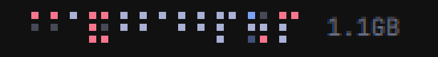
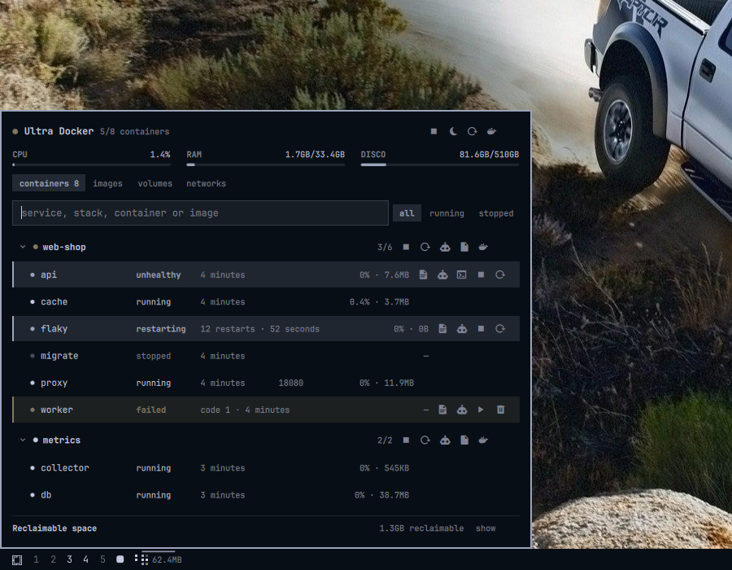

# Ultra Docker

One cell per container, coloured by state, sitting in the icon area of the bar.
CPU and memory cycle beside it. Clicking gets you stacks, restart and logs —
and hands anything deeper to lazydocker, already scoped to the stack you
clicked.



That is a whole development machine — every container, every stack — in about
the width of two icons. The wider gaps mark where one stack ends and the next
begins, so you can point at a stack rather than hunt for it; the colours say how
each container is doing. Nothing in it is a number you have to stop and read,
which is the entire idea.



## Why a mosaic

`docker ps` on a development machine does not fit on a screen. The machine this
was written on runs 25 containers across 7 compose projects; a container stuck
in `Restarting` sits there unnoticed for hours.

So the widget shows no number you have to read. The shape tells you how many
containers there are, the colours tell you how they are doing, and the one cell
that pulses is the one that needs you.

Containers of the same compose stack sit together in their own block of
columns, filled top to bottom, with a wider gap marking where one stack ends and
the next begins. The blocks are what let you point at a stack; without them
adjacency is not separation.

**Cell size is the lever that matters.** A smaller cell does not merely shrink
the mosaic — it fits another row into the same bar, and the width falls away
much faster than the cell does. On a 26px bar with 25 containers in 7 stacks:

| Cell | Rows | Width |
|---|---|---|
| 7px | 2 | 128px |
| 5px | 3 | 83px |
| 3px | 4 | 61px |

**Cells are sized on the device pixel grid.** If you run with `QT_SCALE_FACTOR`
set — 0.85 here — a cell that is a whole number of logical pixels is a fraction
of a real one, and the renderer draws some cells a pixel wider than others. The
sizes are chosen so that the cell, the gap and the pitch are all whole device
pixels, which is what makes every cell come out identical.

**How wide it may get is a budget, not a container count.** Past `maxWidth` the
mosaic collapses to one cell per stack, and past that to a single block. This is
also what makes a short bar work: fewer rows fit, the detailed view would sprawl,
and it collapses on its own instead of eating the bar.

**Every cell is the same size**, and a row with fewer cells is centred rather
than stretched — a wider cell would look like it meant something (a bigger
stack? more containers?) when it means nothing. Position and colour carry the
information; size and shape carry none.

**Cells never move.** Ordered by project, then service, then name, with
containers started outside compose last. The order never depends on state, so a
cell stays put when its stack breaks. The popup does sort degraded stacks to the
top, because that is a list you read rather than a shape you recognise.

| Colour | Meaning |
|---|---|
| foreground | running, healthy or without a healthcheck |
| accent | unhealthy, restarting or paused |
| urgent | exited with a non-zero code, or dead |
| dimmed | stopped cleanly, or created and never started |

## Install

```bash
omarchy plugin add \
  https://github.com/chameleonbr/omarchy_ultra_docker.git \
  --enable \
  --yes
```

Requires `docker` (and your user in the `docker` group — no root, no polkit).
`lazydocker` is optional; the buttons that open it are only useful if you have
it installed.

## Using it

**In the bar**

| Action | What happens |
|---|---|
| left click | popup with stacks, containers and actions |
| middle click | lazydocker for the whole daemon |
| right click | your web UI if you set one, otherwise a refresh |
| scroll | jump to the next metric without waiting for the rotation |

Set `primaryAction` to `lazydocker` if you would rather have left click skip
the popup entirely.

**In the popup**

Stacks come first if they are degraded. A stack starts, stops and restarts as a
unit, or opens lazydocker scoped to itself.

Each container offers only what its state allows — no start button on something
already up, no remove on something running — from logs, a shell, unpause,
start/stop, restart, remove, and one button that hands its log to your coding
agent. Published ports are clickable and open `http://localhost:<port>`.

**A stack action names its containers, not `compose`.** It used to shell out to
`compose up -d`, which meant telling compose where the project lived — and the
only record of that is a label, which the image writes rather than you. Pointing
`compose -f` at a file an image chose and then asking it to bring the stack up
hands container creation to whoever built that image. The container ids come
from the listing that drew the stack, so they always exist, and restarting
exactly those containers is what "restart stack" means. `down` is never run: it
would delete the containers and their networks.

## Reclaiming disk

At the bottom of the popup, what Docker is holding that you could get back,
broken out by kind, each with its own button and its own confirmation:

| | |
|---|---|
| build cache | `docker builder prune -f` — rebuilt on the next build |
| dangling images | `docker image prune -f` — untagged layers from rebuilds |
| unused images | `docker image prune -a -f` — pulled again when needed |
| stopped containers | `docker container prune -f` — their logs go too |
| volumes | listed, never pruned from here |

Two details other panels get wrong and this one does not:

**The number next to "unused images" belongs to `prune -a`, not `prune`.**
`docker system df` reports as reclaimable every image no container is using —
which is what `image prune -a` removes. Plain `image prune` takes only dangling
layers and frees far less. Showing one number and running the other command
makes the panel a liar, so they are separate rows.

**Dangling images show a dash, not `0B`.** `system df` has no row for them, and
printing zero would read as "nothing to do" when there may be plenty.

**Volumes are shown and never pruned.** Everything else on that list can be
rebuilt or pulled again. A volume is the one thing that is somebody's data, and
a one-click button is the wrong shape for deleting it. Use `docker volume prune`
in a terminal if you mean it.

## Notifications

When a container turns unhealthy, starts looping on restart, or exits with an
error, you get a desktop notification — and one quiet one when it recovers.

It compares snapshots rather than following the event stream, because events
fire for every intermediate step of a restart and the only thing worth
interrupting someone for is where the container ended up. The first read after
the shell starts is silent, so a restart never announces everything at once. A
container someone stopped cleanly and started again is not a recovery, and says
nothing.

**Do Not Disturb is respected.** Silence someone asked for is silence, so
nothing here bypasses it — not even the ones marked critical. To stop them
entirely, turn the `notifications` setting off.

## Asking the agent

The robot button on a container captures its recent log and opens your default
Omarchy agent on it, with the facts that usually explain a container that will
not stay up: state, exit code, restart count, health, image, and the compose
stack it belongs to.

The log goes to a file under `$XDG_RUNTIME_DIR/omarchy-docker/` and the prompt
points at it — a few hundred lines of container output does not belong in argv,
and every agent reads files. The agent starts in the stack's own directory when
compose recorded one, so the compose file it may need to edit is right there.
The prompt asks it to diagnose and to change nothing without asking first.

Set your agent with `omarchy default agent <name>` — without one the button says
so rather than failing quietly.

It also works by hand:

```bash
bin/omarchy-docker-ask-agent <container-id> [name] [tail]
```


## About the lazydocker buttons

lazydocker's CLI takes `-p <project>` and `-f <file>` and nothing else — there
is no way to open it focused on one container. So this plugin offers exactly
what lazydocker actually supports:

- **the whole daemon**, from the bar or the popup header
- **one compose stack**, using the `working_dir` and `config_files` that compose
  writes onto every container it starts

Container-level views that lazydocker cannot give you use plain docker instead:
logs open `docker logs -f`, the shell opens `docker exec -it` with a fallback
from bash to sh.

Every one of these goes through `omarchy launch or focus tui`, so clicking the
same button twice focuses the window that is already open instead of stacking
another terminal on your workspace. Each scope gets its own window id, so the
lazydocker you opened for one stack and the one you opened for another are two
windows that stay out of each other's way.

## Where the windows open

Clicking a bar widget does not move keyboard focus, so a terminal launched from
one lands on whichever monitor happened to be focused — often not the monitor
you clicked. Every launch focuses the widget's own screen first, so the window
appears where you asked for it.

## IPC

The same actions are reachable from a Hyprland binding:

```bash
omarchy-shell avila.ultra-docker toggle
omarchy-shell avila.ultra-docker toggleOn DP-1     # on one specific monitor
omarchy-shell avila.ultra-docker lazydocker
omarchy-shell avila.ultra-docker stack web-shop
omarchy-shell avila.ultra-docker refresh
```

## Settings

The gear in the panel header opens the settings screen, on top of the panel.
Every option is on it, with its explanation next to it, and each one applies as
you change it — there is no save button and no restart. A row that is no longer
at its default grows a small reset arrow; the header says how many settings
have moved and can put all of them back.

Open it straight from a keybinding:

```bash
omarchy-shell avila.ultra-docker settings
```

The panel opens in command mode — nothing has a text cursor in it, so the
letters are shortcuts:

| Key | What it does |
|---|---|
| `f` or `/` | Find: moves into the search field |
| `s` or `,` | Settings, and back again |
| `r` | Refresh |
| `1` … `9` | Jump to a section — the tabs in the list, the groups in the settings |
| `Tab` / `Shift+Tab` | Next / previous section |
| `Esc` | One step back: out of the field, then settings, then the filter, then the panel |

Once you are in the search field every key is a character again; `Esc` hands
the keyboard back, keeping the filter.

The screen is built from the plugin's own manifest, so it is never out of date
with what the widget actually reads. Everything it writes lands in the widget's
entry under `bar.layout` in `~/.config/omarchy/shell.json`, which you can still
edit by hand or from the CLI if you prefer:

```bash
omarchy bar set avila.ultra-docker palette ocean
omarchy bar set avila.ultra-docker metricCount true --json   # --json for numbers and booleans
```

The options worth knowing about:

| Setting | Default | Why you might change it |
|---|---|---|
| `groupBy` | `auto` | force one cell per container, or per stack |
| `cellSize` | 4 | smaller cells buy rows, and rows buy width |
| `maxWidth` | 160 | where `auto` gives up and collapses to stacks |
| `groupStacks` | true | off drops the stack blocks for plain balanced rows |
| `stackGap` | 3 | how far apart the stack blocks sit |
| `palette` | `theme` | fixed cell colours instead of the theme's — `traffic`, `ember`, `ocean`, `violet`, `mono`, or `custom` |
| `paletteCustom` | — | three hex values for `custom`, in order: healthy, warning, broken |
| `stackOrder` | `failed` | how the popup lists stacks: `failed` first, `name` A–Z, or `running` first |
| metric checkboxes | cpu, mem | one per metric — CPU, memory used, memory %, network in, running count — untick them all to hide the label |
| `statsIntervalMs` | 30000 | `docker stats` is slow; see below |
| `statsOnBattery` | false | sample CPU and memory on battery too |
| `hideProjects` | — | stacks you never want to see |
| `dockerUrl` | — | a web UI to open on right click — Portainer, Dozzle, whatever you keep |

`stackOrder` is the popup's list only. The bar mosaic stays alphabetical
whatever it is set to: a cell that jumps when a container breaks is a cell you
have to read, and the mosaic exists so you do not have to.

Cell colours follow the active Omarchy theme by default and change with it.
Picking a named palette opts out of that — a decision that red means broken
regardless of the wallpaper.

## A note on cost

`docker stats --no-stream` took **2.1 seconds** for 20 containers on the machine
this was built for. That is why container state and container metrics are on
completely separate clocks:

- **state** follows the `docker events` stream, so it is live and costs nothing
  while nothing is happening
- **metrics** run on their own slow timer, never on the event path, never twice
  at once, and not at all while no widget is on screen or while you are on
  battery

If you make `statsIntervalMs` small, you are asking your machine to spend two
seconds of docker doing bookkeeping that often. It is your call, but the default
is 30 seconds for a reason.

## Development

```bash
node test_docker.js
```

205 checks, no framework, no network, no daemon. `fixtures/` holds real
`docker ps` and `docker stats` output; the tests run against that.

See `CLAUDE.md` for how the pieces fit and what has already bitten.

## Language

English and Portuguese, following `LANG` by default. Set `language` to `en` or
`pt` to override. Anything untranslated falls back to English rather than
showing the key.

## Security

The plugin runs entirely as you. There is no root, no polkit, no setuid: it
calls the `docker` CLI, which works because your user is in the `docker` group.
That group is root-equivalent on the host — if you have it, this plugin can do
what you can do, and nothing more.

Deliberate choices, rather than accidents:

- **Nothing destructive without a named confirmation.** Removing a container and
  every prune button state what will be removed and how much, because "are you
  sure?" teaches people to click yes.
- **Volumes are never pruned from the panel.**
- **No forced removal.** Remove is offered only on containers that are already
  stopped; a button that quietly runs `rm -f` eventually deletes something
  someone was using.
- **Image labels are treated as hostile.** `com.docker.compose.project` and
  `.service` are rendered as the stack and service names, and any image can set
  them to anything — a pulled image is not a trusted source. Every label-derived
  string is rendered as plain text, so a crafted one cannot be interpreted as
  markup, and every one that reaches a shell is quoted.
- **A label is not a path.** `com.docker.compose.project.working_dir` and
  `.config_files` are labels too, so an image can name any directory it likes
  and a plain `LABEL` line in a Dockerfile is enough — running the image is the
  whole precondition. Every label-derived path is validated before use, and the
  agent handoff additionally requires a real directory, not a symlink, owned by
  you, that actually holds a compose file.
- **Container logs are written with `umask 077`** into a directory checked to be
  yours, because logs routinely carry connection strings and tokens. The file is
  created rather than truncated, so it is always one this run made. The agent
  handoff writes there; nothing else reads it.
- **Untrusted text never poses as an instruction.** The agent handoff quotes
  labels and points the agent at a log the container wrote. Both are fenced,
  flattened to one bounded line, and preceded by a note telling the agent they
  are data that may be pretending otherwise.
- **Everything the daemon prints is bounded before it is read**, not after it is
  parsed — each one-shot command runs under `head -c` so the shell never holds
  an unbounded payload, and the long-lived event stream asks for two fields
  rather than the labels it does not need. Logs are bounded by bytes as well as
  by lines: `--tail` counts lines, and one line has no length.

Found something? Open an issue.

## License

MIT
